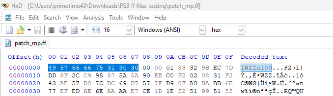
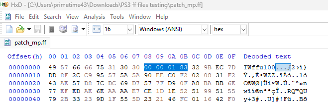

# FastFiles (World at War)

## What is a FastFile?

FastFile (`.ff`) is a proprietary archive format used by the IW Engine in Call of Duty games. It stores **zone files** - bundled, precompiled game assets such as menus, scripts, models, sounds, and videos.

**Key Characteristics:**
- FastFiles contain compressed zone files using **zlib deflate compression**
- PS3/Xbox 360 files are **Big Endian**, PC is **Little Endian**
- Xbox 360 MP files may be **signed** with RSA signatures

- [More Info on COD Research Wiki](https://codresearch.dev/index.php/Category:FastFiles)

---

## File Header Structure

The FastFile header is **12 bytes** total:

| Name    | Offset | Size | Type    | Description                                              |
|---------|--------|------|---------|----------------------------------------------------------|
| Magic   | 0x00   | 8    | char[8] | `"IWffu100"` (unsigned) or `"IWff0100"` (signed)         |
| Version | 0x08   | 4    | int32   | `0x183` for World at War (endian-dependent)              |
| Blocks  | 0x0C   | ...  | -       | Compressed data blocks follow                            |

### Magic Identifiers

| Magic       | Description                                    |
|-------------|------------------------------------------------|
| `IWffu100`  | Unsigned FastFile (standard format)            |
| `IWff0100`  | Signed FastFile (Xbox 360 MP only)             |

### Visual Example
- First 8 bytes: Magic identifier
  
- Next 4 bytes: Version (0x183 for WaW)
  

---

## Version Numbers

Version numbers identify the game/engine version. They're stored at offset 0x08 in the header.

| Platform       | Version | Hex Bytes (as stored)         |
|----------------|---------|-------------------------------|
| PS3            | 0x183   | `00 00 01 83` (Big Endian)    |
| Xbox 360       | 0x183   | `00 00 01 83` (Big Endian)    |
| PC             | 0x183   | `83 01 00 00` (Little Endian) |
| Wii            | 0x19B   | `00 00 01 9B` (Big Endian)    |

> **Note:** Version bytes are always 4 bytes, but endianness depends on platform. Wii
> shares the engine version family but uses a **different** version number (`0x19B`).

---

## Compression

FastFiles use **zlib deflate compression** with data split into blocks.

### Block Structure

Each compressed block follows this format:

```
[2-byte length prefix (big-endian)] [compressed data] ... [0x00 0x01 terminator]
```

| Component           | Size    | Description                                           |
|---------------------|---------|-------------------------------------------------------|
| Block Length        | 2 bytes | Big-endian size of compressed data                    |
| Compressed Data     | varies  | Zlib/deflate compressed data (without 2-byte header)  |
| End Terminator      | 2 bytes | `0x00 0x01` marks end of file                         |

### Compression Details

- **Block Size:** Each uncompressed block is up to **64 KB (0x10000 bytes)**
- **Algorithm:** Zlib deflate (typical header bytes `0x78 0xDA` are stripped)
- **PS3:** Zone data splits into 0x10000-byte blocks, each compressed independently
- **Xbox 360:** Entire zone may be compressed as one unit, with signed files using 0x200000-byte XBlocks

### Per-Platform Compression (Important)

The 64KB-block scheme above is used by the **console** builds. **PC and Wii are
different** — they use a **single continuous zlib stream** with no block length prefixes
and no `00 01` terminator:

| Platform | Outer compression | Endianness | Notes |
|----------|-------------------|------------|-------|
| PS3 | 64KB blocks (raw deflate, BE 2-byte lengths) | Big | `00 01` end marker |
| Xbox 360 | 64KB blocks (raw deflate) | Big | Signed MP adds a signature block |
| **PC** | **Single zlib stream** | **Little** | No blocks, no end marker — zlib starts at `0x0C` |
| **Wii** | **Single zlib stream** | **Big** (PowerPC) | No blocks, no end marker — zlib starts at `0x0C` |

**PC WaW** layout (verified byte-stable round-trip across retail samples):

```
00..07  IWffu100
08..0B  83 01 00 00            version 0x183 (LE)
0C..EOF [single zlib stream]   starts with 78 01 / 78 9C / 78 DA / 78 5E
```

**Wii WaW** is identical in shape but with **big-endian** version bytes
(`00 00 01 9B`). Both decompress by feeding everything from offset `0x0C` to EOF into a
single zlib stream. Note PC and Wii zone **contents** still differ in byte order — see
[Zone.md](Zone.md).

### Decompression Flow

```
FastFile (.ff)
    → Read header (12 bytes)
    → Read 2-byte block length
    → Read compressed data
    → Decompress with zlib
    → Repeat until 0x0001 terminator
→ Zone File (.zone)
```

### Recompression Flow

```
Zone File (.zone)
    → Split into 64 KB blocks
    → Compress each block with zlib
    → Write 2-byte length prefix (big-endian)
    → Write compressed data
    → Write 0x0001 terminator
    → Prepend header (magic + version)
→ FastFile (.ff)
```

---

## Signed vs Unsigned FastFiles

### Magic Identifiers

| Magic       | Hex Bytes                          | Description                |
|-------------|------------------------------------|----------------------------|
| `IWffu100`  | `49 57 66 66 75 31 30 30`          | Unsigned (standard)        |
| `IWff0100`  | `49 57 66 66 30 31 30 30`          | Signed (Xbox 360 MP)       |

### Unsigned FastFiles (Standard)
- Used by: PS3 (all), Xbox 360 SP, PC
- No signature verification
- Compressed data starts immediately after header

### Signed FastFiles (Xbox 360 MP)
- Used by: Xbox 360 Multiplayer files only
- Include a **0x4000-byte (16KB) signature block** after the 12-byte header
- Compressed data starts at offset 0x400C (12 + 0x4000)

```
[12-byte header] [0x4000-byte signature block] [compressed data blocks]
```

The signature block contains:
- RSA2048 signatures for tamper detection
- Multi-layer hash validation
- Magic: `"IWffs100"` within the block

### Build Signing Status (World at War)

| Build   | Single Player | Multiplayer |
|---------|---------------|-------------|
| 253     | Unsigned      | Unsigned    |
| 270     | Unsigned      | Unsigned    |
| 290     | Unsigned      | Unsigned    |
| 328     | Unsigned      | **Signed**  |
| Retail  | Unsigned      | **Signed**  |

### Detecting Signed Files

```csharp
// Check magic bytes at offset 0
bool isSigned = magic == "IWff0100";  // 5th byte is '0' not 'u'
bool isUnsigned = magic == "IWffu100"; // 5th byte is 'u'

// If signed, skip 0x4000 bytes before reading compressed data
int dataStart = isSigned ? 0x400C : 0x0C;
```

> **Bypass:** Signed FastFile verification can be bypassed by patching the game executable to ignore signature checks, or by using JTAG/RGH modified consoles.

---

## Pointer System

The IW Engine uses a custom pointer loading system. In zone files on disk, pointers are stored as placeholder values:

| Value in File     | Meaning                                              |
|-------------------|------------------------------------------------------|
| `0xFFFFFFFF` (-1) | Memory pointer placeholder - gets replaced with actual memory address when loaded |
| `0xFFFFFFFE` (-2) | Memory pointer placeholder (alternate marker)        |
| Other values      | Index into `g_streamBlocks` array (first 3-4 bits)   |

When the game loads a zone into memory, all `FF FF FF FF` placeholders are replaced with actual pointers to the asset data in memory.

---

## References

- [COD Research Wiki - FastFiles](https://codresearch.dev/index.php/Category:FastFiles)
- [OpenAssetTools](https://github.com/Laupetin/OpenAssetTools) - FastFile parsing/compilation tools
- [Xbox 360 FastFile Info](https://github.com/Laupetin/OpenAssetTools/issues/298#issuecomment-2471761312)
