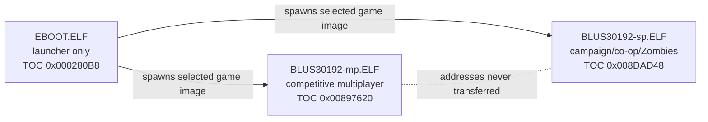
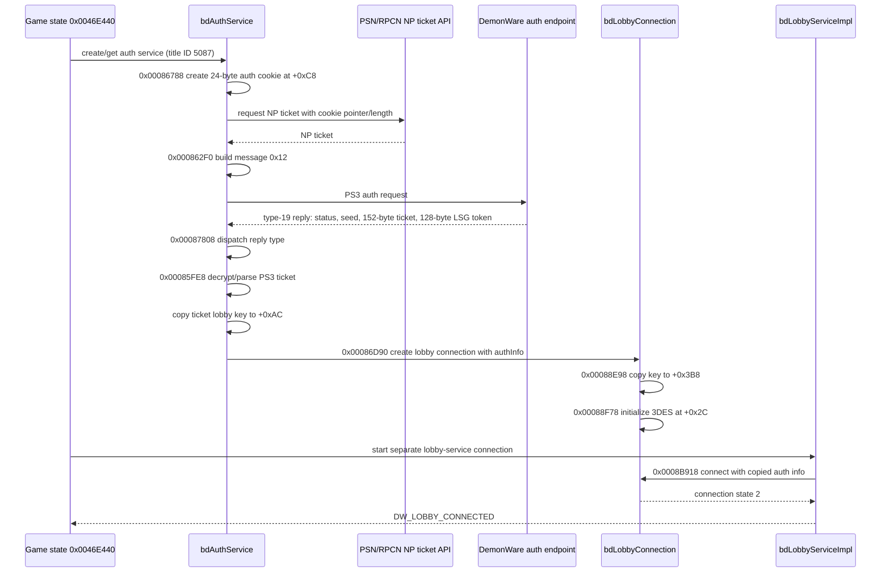
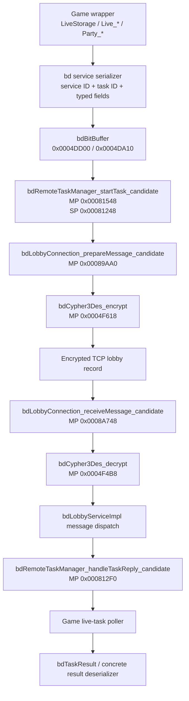
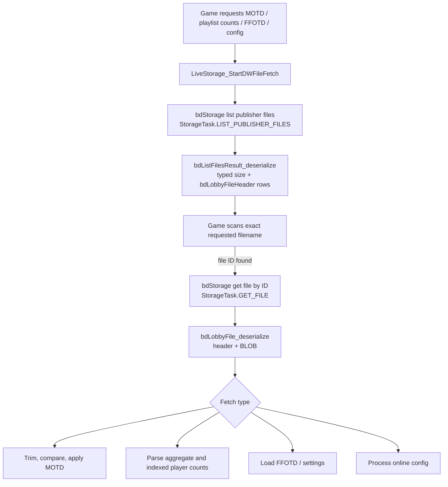
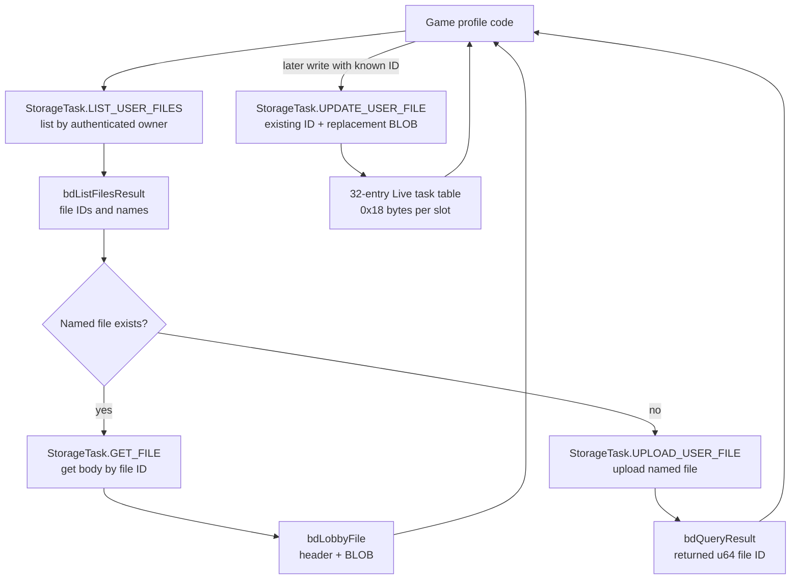
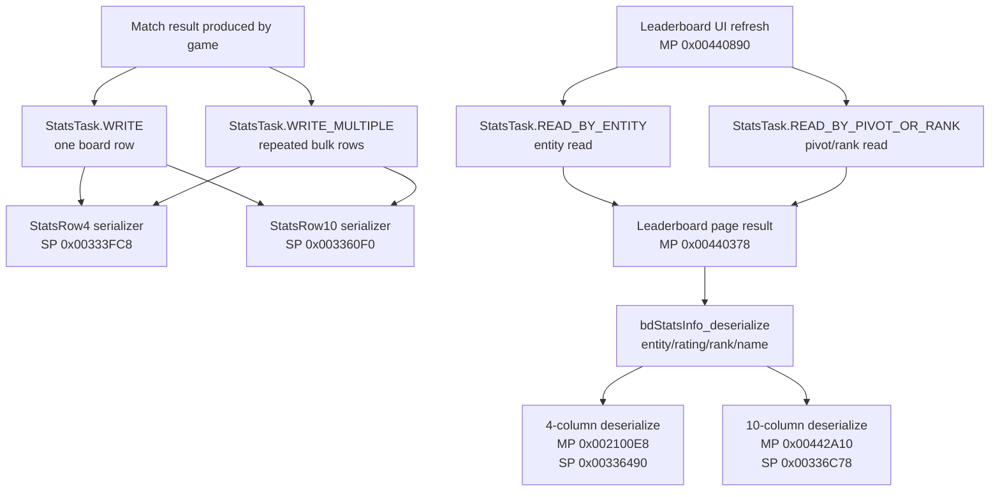
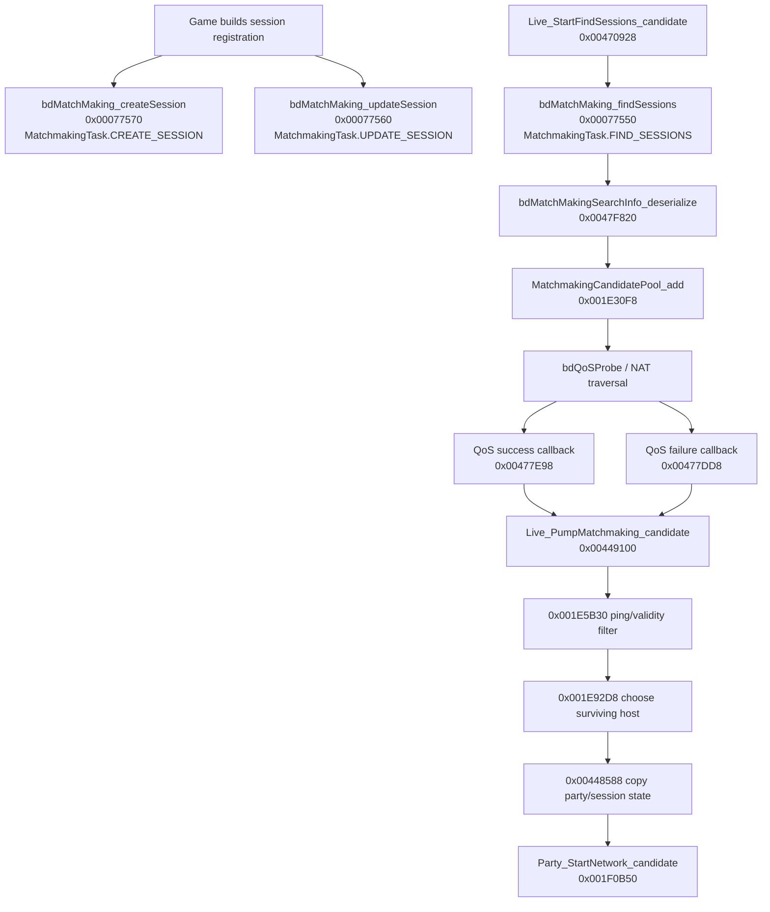
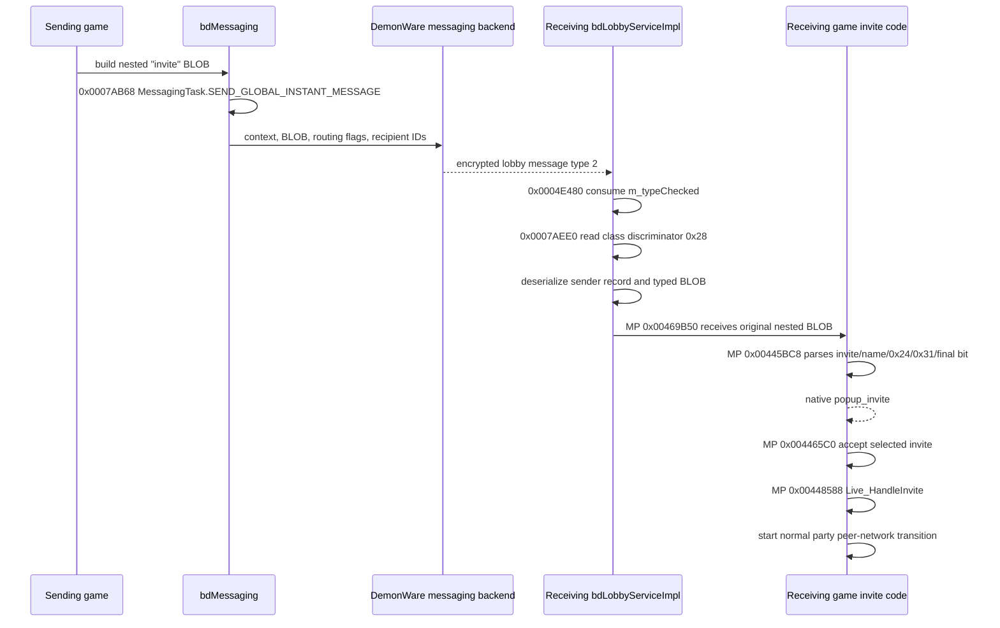
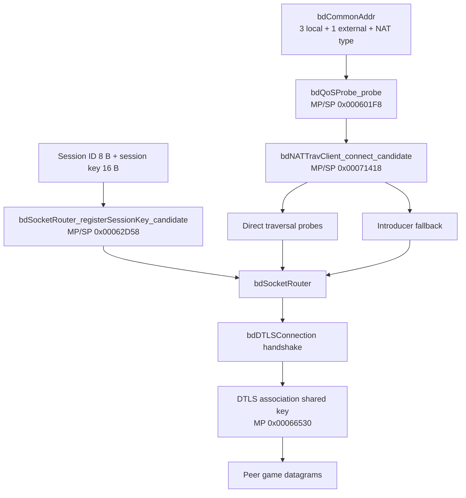

# BLUS30192 DemonWare ELF Call-Flow Charts

These diagrams show the client code in the canonical PS3 executables. Nodes are
functions, in-memory objects, or wire messages used by the game. They do not
model a replacement server or its persistence layer.

Mermaid is used so the same source renders on GitHub and other compatible
Markdown viewers. Diagram labels use the recovered symbolic operation names;
the corresponding numeric wire values are kept in the
[DemonWare operation lookup](Wire-Formats.md#demonware-operation-names).

## Image and address ownership

All three images enter code at `0x00010230`, but they use different entry
descriptors and TOCs. That repeated entry address is not shared function
identity.

## PS3 authentication to lobby connection (MP)

The auth cookie decrypts the type-19 client ticket. The lobby key inside that
ticket encrypts subsequent lobby records. The 128-byte LSG token is neither of
those keys.

## Encrypted remote-task lifecycle

The pending `bdRemoteTask` owns a normal typed reply buffer at `+0x18` or a
byte-mode LSG result at `+0x1C`. Polling reads state at `+0x14`.

## Publisher-file bootstrap

Relevant wrapper pairs:

| Stage | MP | SP |
| --- | ---: | ---: |
| request localized MOTD | `0x004585D0` | `0x0034D178` |
| shared fetch starter | `0x00458AB0` | `0x0034D668` |
| start publisher-file list | `0x0047BEB0` | `0x0036EC60` |
| poll/scan list | `0x0047B6D0` | `0x0036E480` |
| poll downloaded file body | `0x0047BA80` | `0x0036E830` |

## User-file lifecycle

MP and SP both use the literal filenames `mpdata` and `badmpdata`, but that
matching spelling does not prove the blobs have the same internal layout.

## Stats and leaderboard flow

The concrete C++ row type, not the task operation alone, controls the column
count. SP `StatsTask.WRITE` has been captured with a four-column row, while
`StatsTask.WRITE_MULTIPLE` can invoke a virtual concrete serializer.

## Matchmaking discovery to peer-network start (MP)

A successful `MatchmakingTask.FIND_SESSIONS` reply is only a candidate offer.
Static evidence reaches peer-network start; it does not show a later DemonWare
operation that proves the peer join completed.

## Native game-invite flow

SP independently serializes the same `0x31` join-block ordering and its native
acceptance path reaches the same kind of party-network transition; MP addresses
above are not transferred to SP.

## Peer addressing and secure transport

The DTLS association derives a separate 24-byte shared key and initializes its
own 3DES state. It is not the lobby session key.
