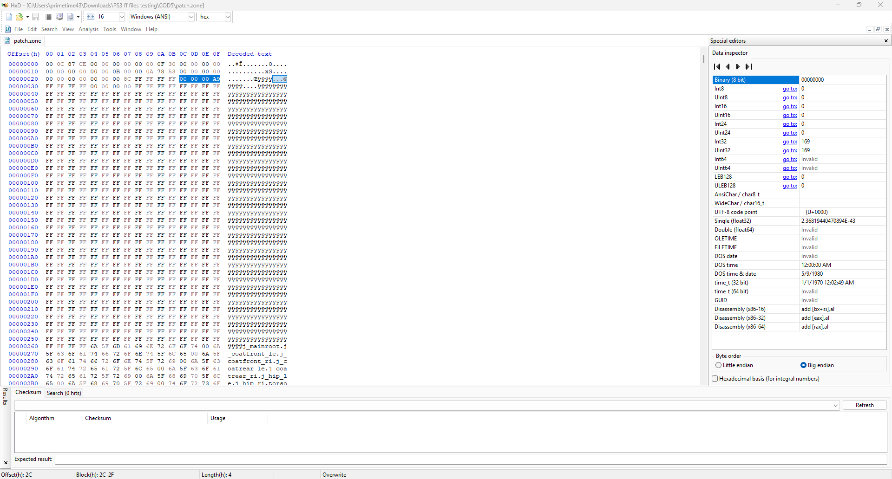
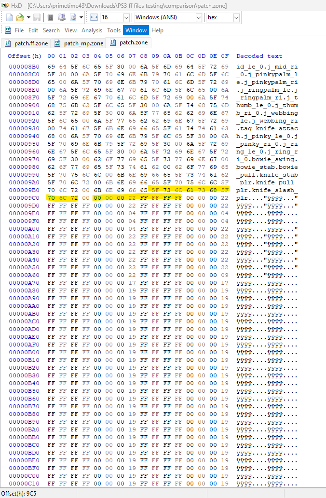
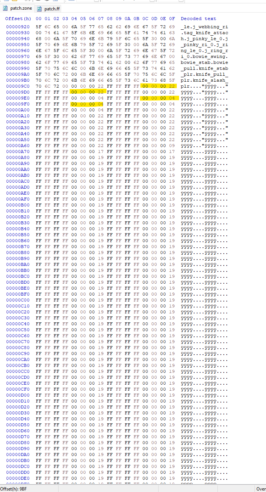
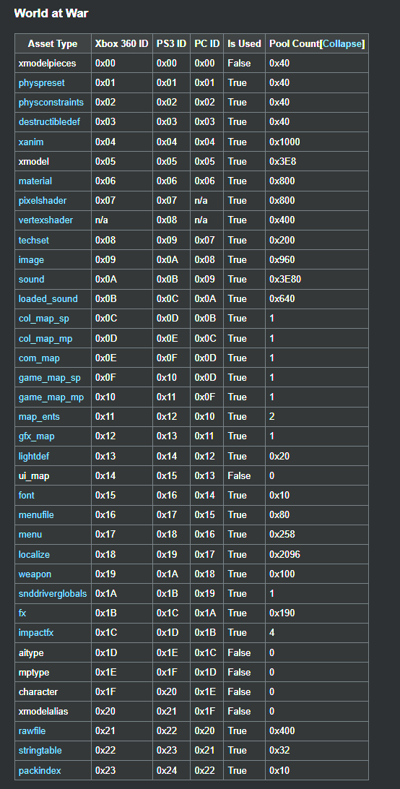
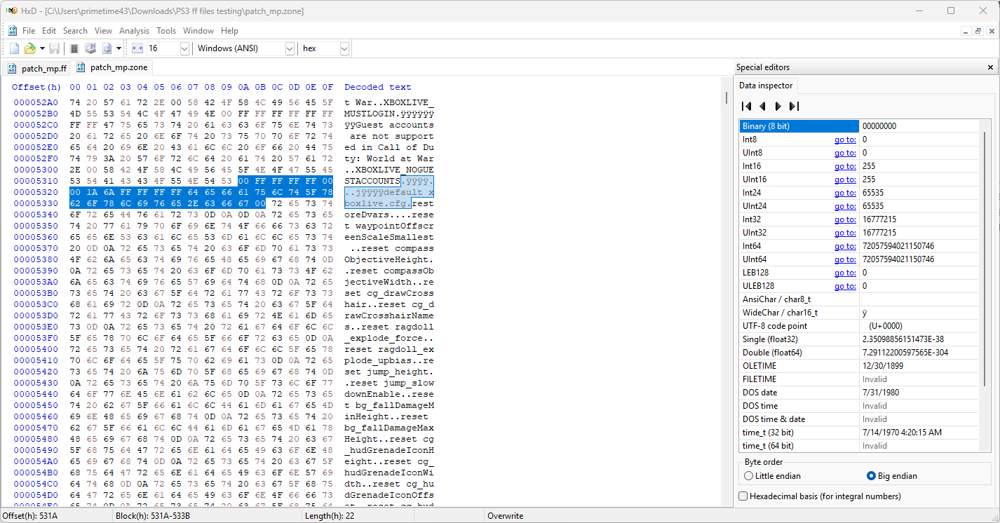
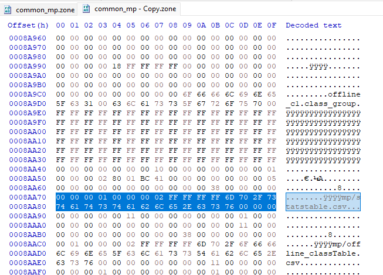
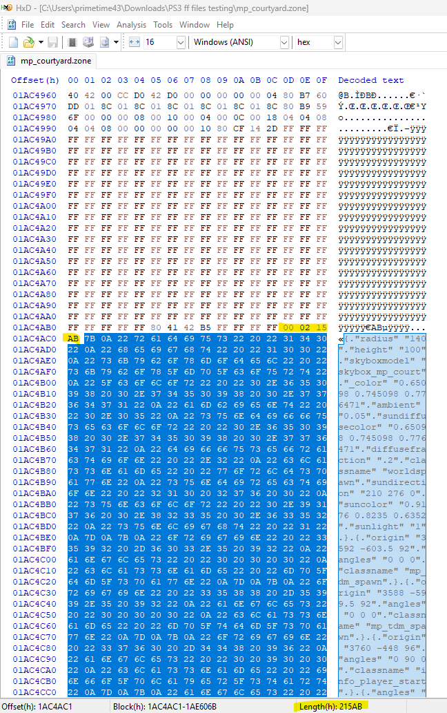
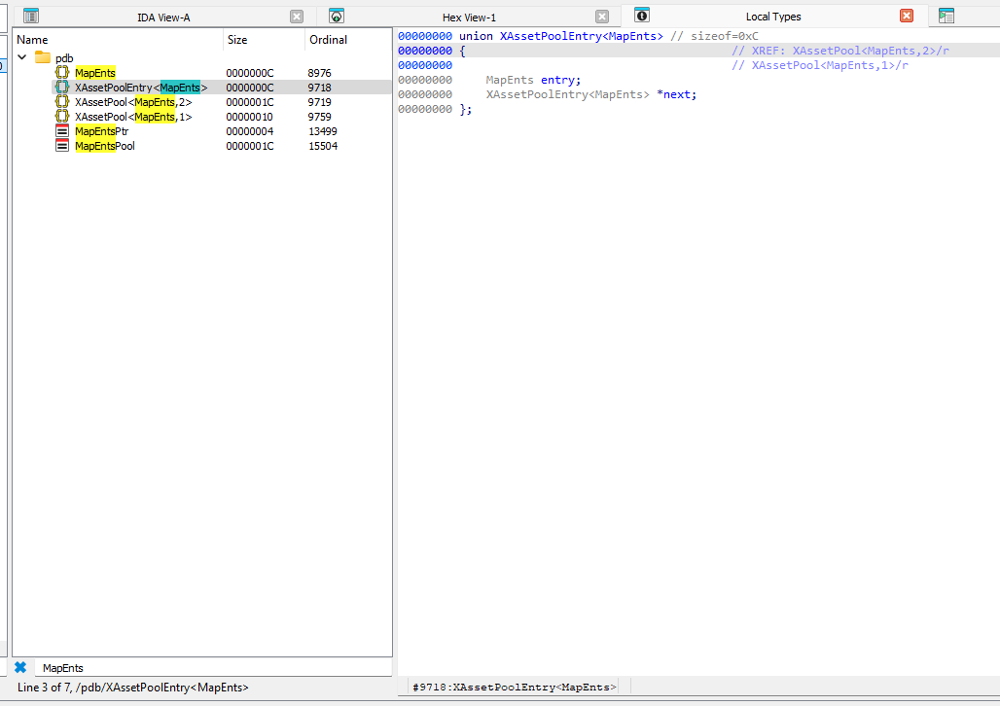
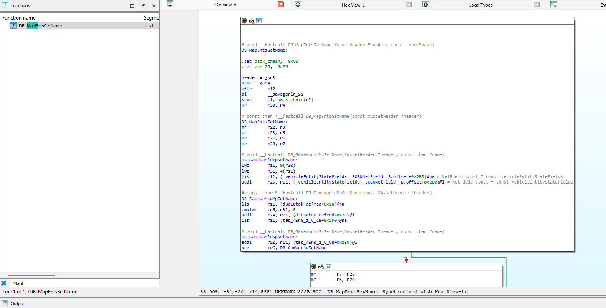

# Zone Files (World at War)

## Overview

Zone files are the **decompressed content** stored inside FastFiles. A zone is essentially a library of game [assets](https://codresearch.dev/index.php/Category:Assets) bundled together. When you decompress a FastFile (.ff), you get a Zone file (.zone).

**Platform Support:**
- **PS3**: Big-endian, includes vertexshader
- **Xbox 360**: Big-endian, no vertexshader (asset types shifted by -1)
- **PC**: Little-endian, no pixelshader or vertexshader (asset types shifted by -2)

See [FastFiles](FastFiles/FastFiles.md) for information about the compressed container format.

---

## Asset Loading & Patching

### How Patch FastFiles Work

The game loads assets in a specific order, with **patch FastFiles overwriting base game assets**:

1. **Base game assets** are loaded from the disc (e.g., `common_mp.ff`, map files)
2. **Patch FastFiles** (e.g., `patch_mp.ff`) are loaded afterward and **override** any matching assets

This means if an asset exists in both the base game and a patch file, the patch version is used.

### Rebuilding Zones Without All Assets

When rebuilding a zone file, you **don't need to include every asset** that was in the original. The game will fall back to base assets:

- **If an asset is in your rebuilt zone** → Your version is used
- **If an asset is missing from your zone** → The game uses the version from the disc's base FastFiles

This allows you to create minimal patch files containing only the assets you want to modify, rather than extracting and repacking everything.

### Example

If `patch_mp.ff` originally contained 100 rawfiles but you only want to modify 5 scripts:

1. Rebuild the zone with just those 5 modified rawfiles
2. The other 95 rawfiles don't need to be in your patch
3. The game will load those 95 from the base game files on disc

### Practical Use

This is useful for:
- **Smaller patch files** - Only include what you changed
- **Mod distribution** - Distribute minimal patches instead of full zone rebuilds
- **Faster iteration** - Don't need to extract/repack unchanged assets

> **Note:** The asset pool records in your zone header should only list the assets you're including. The count in `AssetCount` must match the actual number of asset records.

---

## Zone File Structure

A decompressed zone file contains the following sections in order:

```
[Zone Header (52 bytes)]
    ├── XFile Structure (24-36 bytes)
    └── XAssetList Structure (16 bytes)
[Script Strings / Tags]
[Asset Pool Records]
[Asset Data]
[Footer / Zone Name]
```

---

## Zone Header

The zone header consists of two structures: **XFile** (memory allocation info) and **XAssetList** (asset metadata).

> **Note:** This header structure is shared across CoD4, WaW, and MW2.

### XFile Structure (Memory Block Allocation)

| Name              | Offset | Size | Type  | Description                                        |
|-------------------|--------|------|-------|----------------------------------------------------|
| ZoneSize          | 0x00   | 4    | int32 | Total size of zone data (excluding 36-byte header) |
| ExternalSize      | 0x04   | 4    | int32 | External resource allocation                       |
| BlockSizeTemp     | 0x08   | 4    | int32 | XFILE_BLOCK_TEMP allocation                        |
| BlockSizePhysical | 0x0C   | 4    | int32 | XFILE_BLOCK_PHYSICAL allocation                    |
| BlockSizeRuntime  | 0x10   | 4    | int32 | XFILE_BLOCK_RUNTIME allocation                     |
| BlockSizeVirtual  | 0x14   | 4    | int32 | XFILE_BLOCK_VIRTUAL allocation                     |
| BlockSizeLarge    | 0x18   | 4    | int32 | XFILE_BLOCK_LARGE allocation                       |
| BlockSizeCallback | 0x1C   | 4    | int32 | XFILE_BLOCK_CALLBACK allocation                    |
| BlockSizeVertex   | 0x20   | 4    | int32 | XFILE_BLOCK_VERTEX allocation (PS3/PC only)        |

### Memory Block Values (Critical for Zone Building)

When creating/rebuilding zone files, these values are **required** for the game engine to properly allocate memory. Incorrect values cause crashes or infinite loading.

| Game | BlockSizeTemp (0x08) | BlockSizeVertex (0x20) |
|------|----------------------|------------------------|
| CoD4 | 0x00000F70 | 0x00000000 |
| WaW | 0x000010B0 | 0x0005F8F0 |
| MW2 | 0x000003B4 | 0x00001000 |

> **Note:** These are the minimum required values for patch zones containing rawfiles. Map zones and zones with other asset types may require different values.

> **PC / Wii exception:** The fixed `BlockSizeTemp` values above are **console-only**.
> **PC and Wii WaW compute `BlockSizeTemp` per zone** rather than using a constant
> (PC WaW values observed across samples: 28, 264, 484, 2,656, 2,098,020). When editing,
> preserve the original zone's value verbatim — there is no single magic constant.

### Wii Zone Header (56 bytes)

WaW **Wii** uses a larger header — it adds a `BlockSizeIndex` slot at `0x24`, so the
`XAssetList` fields all shift down by 4 vs PS3/Xbox 360/PC. Values are **big-endian**
(PowerPC):

| Offset | Field |
|--------|-------|
| 0x08 | BlockSizeTemp |
| 0x20 | BlockSizeVertex |
| 0x24 | **BlockSizeIndex** (Wii only) |
| 0x28 | ScriptStringCount |
| 0x2C | ScriptStringsPtr (`FFFFFFFF`) |
| 0x30 | AssetCount |
| 0x34 | AssetsPtr (`FFFFFFFF`) |
| 0x38 | Asset pool start |

`ZoneSize @0x00 = actualZoneBytes − 40` on Wii (vs `−36` on the 52-byte platforms,
because the header is 4 bytes larger).

> **Wii uses the PC asset enum.** Despite being big-endian, WaW Wii type IDs follow the
> **`CoD5AssetTypePC`** mapping (no `pixelshader`/`vertexshader` slots), *not* the PS3
> enum — verified from a credits zone where the PC interpretation gives a coherent type
> distribution (899 localize, 17 rawfile, …) while the PS3 enum gives nonsense. See
> [AssetTypes.md](FastFiles/AssetTypes.md).

### XAssetList Structure (Asset Metadata)

| Name              | Offset | Size | Type  | Description                                        |
|-------------------|--------|------|-------|----------------------------------------------------|
| ScriptStringCount | 0x24   | 4    | int32 | Number of script strings (tags)                    |
| ScriptStringsPtr  | 0x28   | 4    | int32 | `FF FF FF FF` - memory pointer (populated when loaded) |
| AssetCount        | 0x2C   | 4    | int32 | Number of assets in the pool                       |
| AssetsPtr         | 0x30   | 4    | int32 | `FF FF FF FF` - memory pointer (populated when loaded) |

### Example Header

Zone file with size 333 (0x14D) and 169 asset records:



---

## Script Strings (Tags)

Script strings (also called "tags") are identifiers used by assets. They appear **after the header** at offset 0x34.

### Structure
- Null-terminated ASCII strings
- Count defined by `ScriptStringCount` in header
- Each string ends with `0x00`

### Example



---

## Asset Pool Records

The asset pool contains **8-byte records** for each asset in the zone.

### Record Structure

Each record is 8 bytes (big-endian on PS3):

```
[4-byte type: 00 00 00 XX] [4-byte memory pointer: FF FF FF FF]
```

Example for rawfile (0x22):
```
00 00 00 22 FF FF FF FF
```

The `FF FF FF FF` is a **memory pointer placeholder**. When the zone is loaded into memory, this gets replaced with the actual memory address pointing to the asset's data.

### Final Entry Requirement

**Important:** The asset table must include a **final rawfile entry** after all asset entries. This is required by the game engine.

```
Asset Table = [RawFile entries] + [Localize entries] + [1 Final RawFile entry]
AssetCount = RawFileCount + LocalizeCount + 1
```

Without this final entry, the game will fail to load the zone correctly (infinite loading).

### End Marker

The asset pool ends with an 8-byte marker of all `0xFF`:

```
FF FF FF FF FF FF FF FF
```

### Example

Asset record for rawfile (type 0x22):
```
00 00 00 22 FF FF FF FF
```

End of pool:
```
00 00 00 22 FF FF FF FF FF FF FF FF
└─ Last asset record ──┘ └─ End marker (4 bytes visible) ─┘
```




[Asset Types Reference](https://codresearch.dev/index.php/Category:Assets)

---

## Asset Types (World at War - PS3)

The table below shows **PS3** asset type IDs. Xbox 360 and PC have different IDs due to shader differences.

| ID   | Type              | ID   | Type              | ID   | Type              |
|------|-------------------|------|-------------------|------|-------------------|
| 0x01 | physpreset        | 0x0D | col_map_sp        | 0x19 | localize          |
| 0x02 | physconstraints   | 0x0E | col_map_mp        | 0x1A | weapon            |
| 0x03 | destructibledef   | 0x0F | com_map           | 0x1B | snddriverglobals  |
| 0x04 | xanim             | 0x10 | game_map_sp       | 0x1C | fx                |
| 0x05 | xmodel            | 0x11 | game_map_mp       | 0x1D | impactfx          |
| 0x06 | material          | 0x12 | map_ents          | 0x1E | aitype            |
| 0x07 | pixelshader       | 0x13 | gfx_map           | 0x1F | mptype            |
| 0x08 | vertexshader (PS3 only) | 0x14 | lightdef    | 0x20 | character         |
| 0x09 | techset           | 0x15 | ui_map            | 0x21 | xmodelalias       |
| 0x0A | image             | 0x16 | font              | 0x22 | **rawfile**       |
| 0x0B | sound             | 0x17 | menufile          | 0x23 | **stringtable**   |
| 0x0C | loaded_sound      | 0x18 | menu              | 0x24 | packindex         |

> **Important:** Asset type IDs differ between platforms:
> - **Xbox 360**: No vertexshader, so types >= 0x08 shift by -1 (rawfile = 0x21)
> - **PC**: No pixelshader or vertexshader, so types >= 0x07 shift by -2 (rawfile = 0x20)
>
> See [AssetTypes.md](FastFiles/AssetTypes.md) for complete platform comparison.

---

## Raw File Structure

Raw files contain scripts and configuration files (.gsc, .cfg, .csc, .vision, .atr, .rmb, .arena, etc.).

> **Note:** This structure is the same across CoD4, WaW, and MW2.

### Header Layout

| Name            | Offset | Size     | Type   | Description                               |
|-----------------|--------|----------|--------|-------------------------------------------|
| MemoryPointer   | 0x00   | 4        | int32  | `FF FF FF FF` - memory pointer (populated when loaded) |
| DataLength      | 0x04   | 4        | int32  | Size of file content (big-endian)         |
| MemoryPointer   | 0x08   | 4        | int32  | `FF FF FF FF` - memory pointer (populated when loaded) |
| FileName        | 0x0C   | variable | char[] | Null-terminated file name with extension  |
| NullTerminator  | varies | 1        | byte   | `0x00` separator                          |
| FileContent     | varies | DataLength| char[] | Raw file data                            |
| EndTerminator   | varies | 1        | byte   | `0x00` end marker                         |

The `FF FF FF FF` values are memory pointer placeholders. In the zone file they appear as `-1`, but when loaded into memory they become actual pointers to the asset data.

### Example



### Supported File Extensions

| Extension | Description              |
|-----------|--------------------------|
| `.gsc`    | Game Script              |
| `.csc`    | Client Script            |
| `.cfg`    | Configuration file       |
| `.vision` | Vision settings          |
| `.atr`    | Animation attributes     |
| `.rmb`    | Rumble data              |
| `.arena`  | Arena definitions        |
| `.txt`    | Text files               |

---

## String Table Structure

String tables store tabular data (CSV-like) for localization and game data.

> **Note:** This structure is shared across CoD4, WaW, and MW2.

### C++ Structure

```cpp
struct StringTable
{
    const char *name;       // Table name/path
    int columnCount;        // Number of columns
    int rowCount;           // Number of rows
    const char **values;    // Pointer to cell values
};
```

### Binary Layout

| Name          | Offset | Size     | Type   | Description                              |
|---------------|--------|----------|--------|------------------------------------------|
| NamePointer   | 0x00   | 4        | int32  | `FF FF FF FF` - memory pointer (populated when loaded) |
| ColumnCount   | 0x04   | 4        | int32  | Number of columns (big-endian)           |
| RowCount      | 0x08   | 4        | int32  | Number of rows (big-endian)              |
| ValuesPointer | 0x0C   | 4        | int32  | `FF FF FF FF` - memory pointer (populated when loaded) |
| TableName     | 0x10   | variable | char[] | Null-terminated table path               |
| CellPointers  | varies | 4 * cells| int32[]| Pointer array for each cell              |
| StringPool    | varies | variable | char[] | Null-terminated cell strings             |

### Example



- `00 00 00 01` - 1 column
- `00 00 00 02` - 2 rows
- `FF FF FF FF` - inline pointer
- `6D 70 2F 73...` - table name "mp/statstable.csv"

---

## Localized Entry Structure

Localization entries store translated text strings.

> **Note:** Structure is similar across CoD4/WaW/MW2, but asset type ID differs (0x19 for WaW).

### Binary Layout

```
[8-byte marker: FF FF FF FF FF FF FF FF]
[Localized value: null-terminated UTF-8 string]
[Reference key: null-terminated ASCII string]
```

### Example Usage
- In-game text translations
- Menu labels
- Dialog strings

---

## Map Entities

Map entities are found only in map-specific FastFiles. They define entity data for the map.

> **Note:** This structure is shared across CoD4, WaW, and Black Ops 1.

### C++ Structure

```cpp
struct MapEnts  // sizeof = 0x0C
{
    const char *name;       // Map name
    char *entityString;     // Entity definition string
    int numEntityChars;     // Length of entity string
};
```

### Example

The entity string size appears before the data:





[More Info on Map Entities](https://codresearch.dev/index.php/MapEnts_Asset#Call_of_Duty_4_.26_World_at_War_.26_Black_Ops_1)

---

## Memory Pointers

In zone files, you'll see `FF FF FF FF` values throughout the data. These are **placeholder memory pointers**.

| Value in File  | Meaning                                              |
|----------------|------------------------------------------------------|
| `FF FF FF FF`  | Placeholder (-1 as signed int) - will become a memory pointer when loaded |
| `FF FF FF FE`  | Placeholder (-2 as signed int) - alternate marker    |

**How it works:**
- In the zone file on disk, pointers are stored as `FF FF FF FF`
- When the game loads the zone into memory, these placeholders are replaced with actual memory addresses pointing to the asset data
- This allows the engine to quickly locate assets at runtime

> **Note:** This pointer system is consistent across CoD4, WaW, and MW2.

---

## References

- [COD Research Wiki - Assets](https://codresearch.dev/index.php/Category:Assets)
- [StringTable Asset](https://codresearch.dev/index.php/StringTable_Asset)
- [MapEnts Asset](https://codresearch.dev/index.php/MapEnts_Asset)
